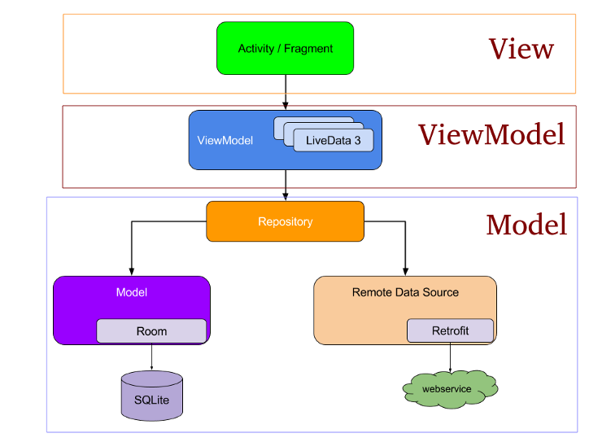

# Santander Dev Week - Kotlin

## Desafio
* Aprender sobre o ecossistema Android
* Criar Layouts fantásticos
* Padrões de arquitetura Android
* Replicar tela home do Santander
* Monitoração de app

## Percurso
- Aula 1
Preparação do ambiente e criação do nosso primeiro app

- Aula 2
Layouts e diretrizes de design

- Aula 3
Padrões arquiteturais e boas práticas de desenvolvimento

- Aula 4
Mmonitoramento e publicaçoes de apps

## Requisitos

* Conceitos de o.o.

## duvidas?
Comunidade online dio (Discord)
  

----------------------------------------------

# Aula 1 - Preparação do ambiente e criação do nosso primeiro app

### Objetivos

1. Instalação do Android Studio
2. Android SDK
3. Android virtual device (AVD)
  

----------------------------------------------

# Aula 2 - Layout e Diretrizes de Design

### Objetivos

1. Principais Layouts para criação de telas
2. Explorando a paleta de componentes
3. Menus
4. Material design

## Principias Layouts

* Linear Layout
Orietaçao de forma linear. Seja na horizontal ou vertical. 
Ideal para formulários e Layouts com comportamento linear

* Constraint Layout
Sem hierarquia muito grande.
`+` recomendado
`-` comlexidade para aprender

> Para adicionar o material design no app
> 

> Fonte de ícones
> 
  

----------------------------------------------

# Aula 3 - Arquitetura e Internacionalização

### Objetivos

1. Padrões arquiteturaris MVC / MVVM
2. Organização do App com MVVM
3. Internacionalização (i18n)

> recomendação google: MVVM

## padrões arquitetura mvc
1. mvc - separa o app em 3 níveis de responsbilidade
2. model - é a lógica ou o core do nosso negócio
3. view - exibe as visualizações do nosso app
4. controller - controle do view e model

### Prós
separa modelos e camadas de viualização

### Contras
forte acoplamento regras de negócios e ligação com a view

## padrões arquiteturais mvvm

1. mvvm - padrão derivativo do MVP Pattern
2. ajuda a separar a camada lógica de UI e vice-versa
3. facilita a testabilidade
4. maior resiliência em app's Android

- view é responsável pela estrutura de Layout exibida na tela
- viewmodel notifica estados e mudanças entre a view e model
- model prove dados para o app
- live data é capaz de conter dados para ser observados
- liveData é ciente do ciclo de vida (dos dados)
- liveData não dá vazamentos de memória (Memory Leaks)
- LiveData dados sempre atualizados

## Internacionalização (i18n)
- define uma alternativa em textos e recursos do app
- possibilita diversas linguas, culturas e regiões para o app

  
----------------------------------------------

# Aula 4 - Monitoramento e Publicação

### Objetivos

1. firebase
2. monitoração

## Firebase
- Plataforma de monitoração
- Conjunto de ferramentas
- Ajuda a identificar crashes do app
- Auxilia na distribuição de apps

### Monitoramento de performance

- Plataforma de monitoração de performance
- Recebe insights sobre caracteristicas de desemepnho de apps
- Ajuda entender aonde o desempenho pode ser melhorado

### Crashlytics
- ferramentas de relatórios de falhas
- ajuda a identificar bugs e manter a resiliência do app
- possível visualizar que tipo de device está sendo atingido
- acompanhamento da saúde de versões do app

### Analytics
- Núcleo do Firebase
- Insigths sobre uso do app e envolvimento de usuários
- Gera relatórios dos diversos tipos de análise

### App Distribution
- Facilita a distribuição do app
- Auxilia o piloto do app
- Ppossibilita disponibilizar para usuários chaves antes de ir para a PlayStore

### Test Lab
- Infraestrutura de testes de apps na nuvem (dispositivo na nuvem)
- Testa o app em uma gama elevada de dispositivos (é preciso programar os testes)
- Possibilita realizar testes de robo e testes instrumentados

### Documentação

## Publicação

- Como gerar uma APK/Bundle assinada
- O importante da key store
- Google Play Console
